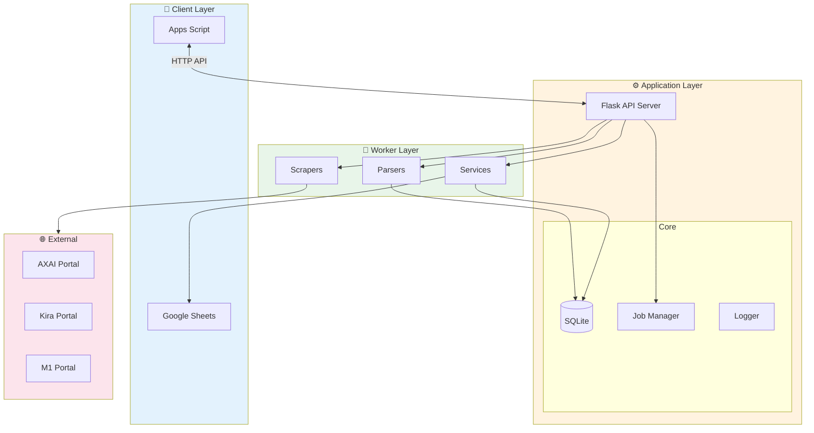
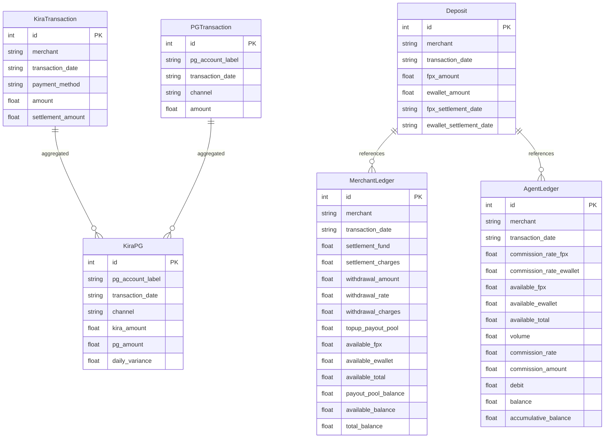

# System Architecture

System architecture for Payment Reconciliation Automation.

## 🏗️ High-Level Architecture

## 📦 Component Overview

### Core Layer
| Component | File | Responsibility |
|-----------|------|----------------|
| Database | `core/database.py` | SQLAlchemy session management |
| Models | `core/models.py` | Data models (Transaction, Deposit, Ledger, etc.) |
| Jobs | `core/jobs.py` | Job tracking and status management |
| Logger | `core/logger.py` | Centralized logging |
| Loader | `core/loader.py` | Configuration loading |

### Scraper Layer
| Component | File | Platform |
|-----------|------|----------|
| BaseScraper | `scrapers/base.py` | Abstract base class |
| AxaiScraper | `scrapers/axai.py` | AXAI payment portal |
| KiraScraper | `scrapers/kira.py` | Kira merchant portal |
| M1Scraper | `scrapers/m1.py` | M1 bank portal |
| Browser | `scrapers/browser.py` | Playwright browser management |

### Parser Layer
| Component | File | Data Type |
|-----------|------|-----------|
| AxaiParser | `parser/axai.py` | AXAI transaction files |
| KiraParser | `parser/kira.py` | Kira transaction files |
| M1Parser | `parser/m1.py` | M1 bank statement files |

### Service Layer
| Component | File | Responsibility |
|-----------|------|----------------|
| SheetsClient | `services/client.py` | Google Sheets API wrapper |
| KiraPGService | `services/kira_pg.py` | Kira vs PG reconciliation |
| DepositService | `services/deposit.py` | Deposit tracking |
| MerchantLedger | `services/merchant_ledger.py` | Merchant balance ledger |
| AgentLedger | `services/agent_ledger.py` | Agent commission ledger |
| SummaryService | `services/ledger_summary.py` | Yearly summary |
| ParameterService | `services/parameters.py` | Parameter management |

### Route Layer
| Endpoint | File | Description |
|----------|------|-------------|
| `/api/sync/*` | `routes/sync.py` | Download & parse triggers |
| `/api/kira-pg/*` | `routes/kira_pg.py` | Kira PG sync |
| `/api/deposit/*` | `routes/deposit.py` | Deposit sync |
| `/api/merchant-ledger/*` | `routes/merchant_ledger.py` | Merchant ledger sync |
| `/api/agent-ledger/*` | `routes/agent_ledger.py` | Agent ledger sync |
| `/api/summary/*` | `routes/ledger_summary.py` | Summary sync |

## 🗄️ Database Schema

## 🔐 Security

- Google Sheets access via Service Account
- Session-based scraper authentication
- SSH tunnel for remote database (optional)
- Credentials stored in `config/` (git-ignored)
