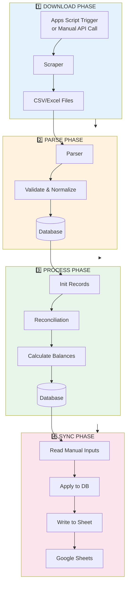
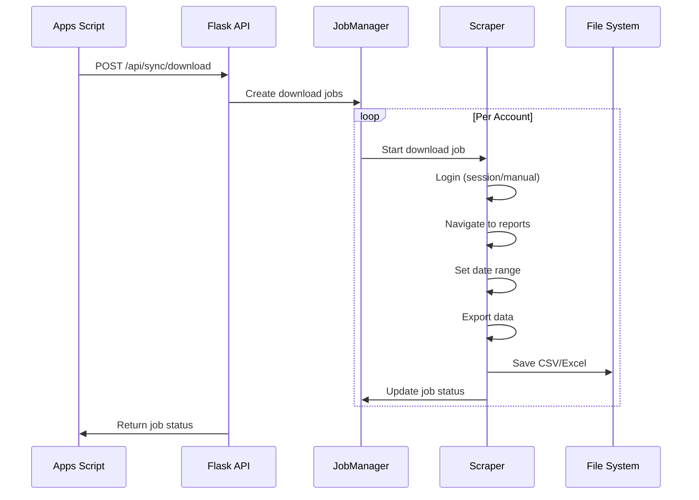
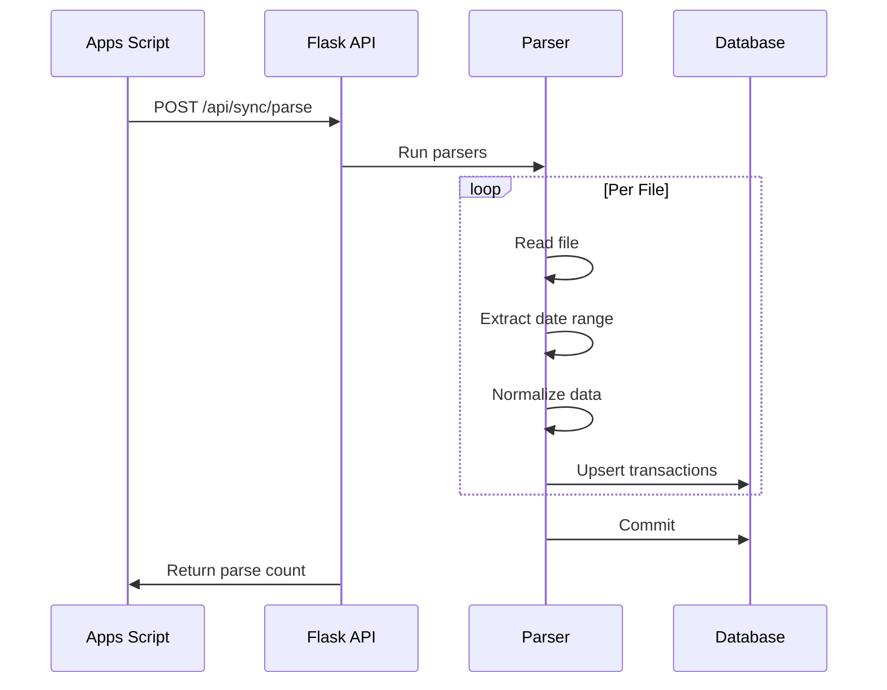
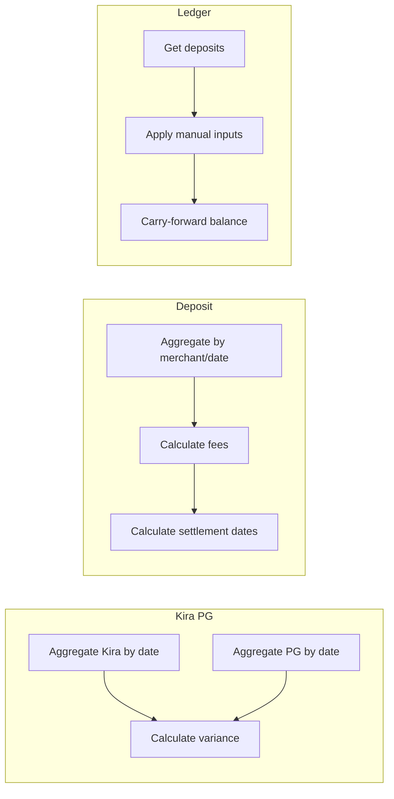
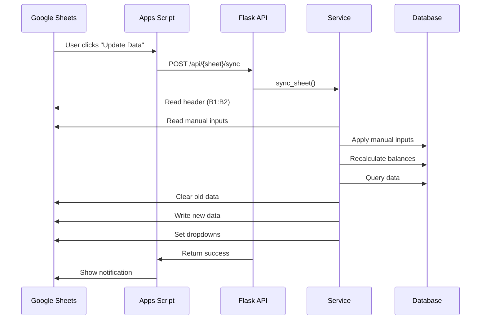

# Data Flow

Data flow from download to Google Sheets sync.

## 🔄 Complete Data Flow

## 📥 Download Phase Detail

## 📄 Parse Phase Detail

## 🔧 Process Phase Detail

Occurs when sheet sync is called:

## 🔄 Sync Phase Detail

## 📊 Data Transformation

| Stage | Input | Output |
|-------|-------|--------|
| Download | Web portal | CSV/Excel files |
| Parse | CSV/Excel files | KiraTransaction, PGTransaction |
| Process | Transactions | KiraPG, Deposit, Ledgers |
| Sync | Database records | Google Sheets rows |
