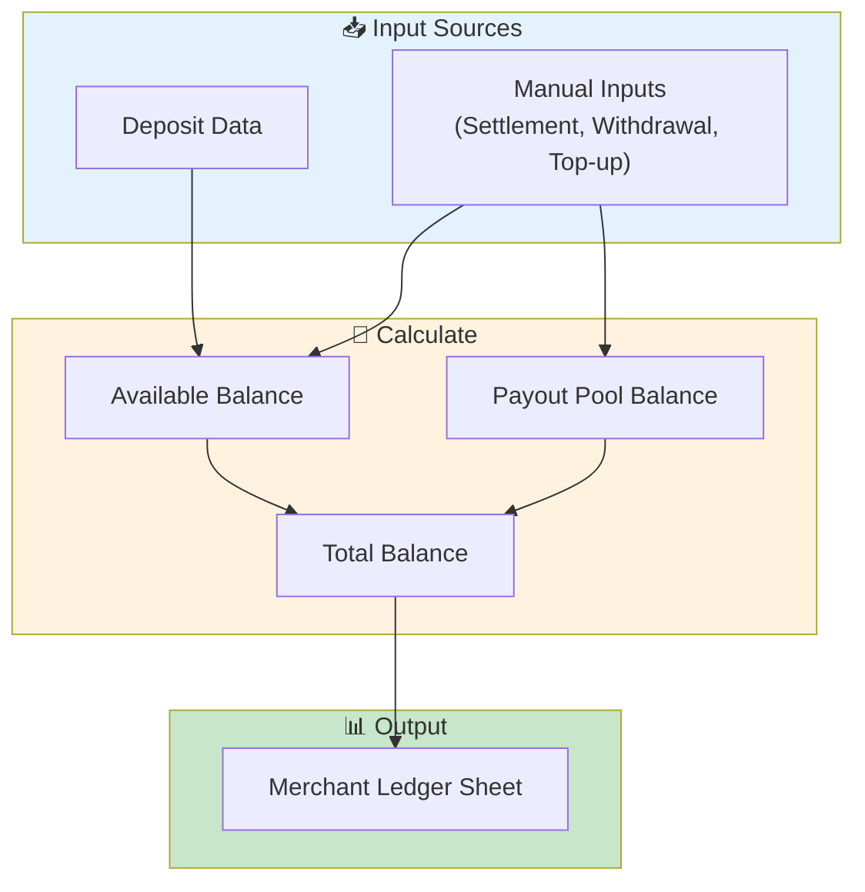
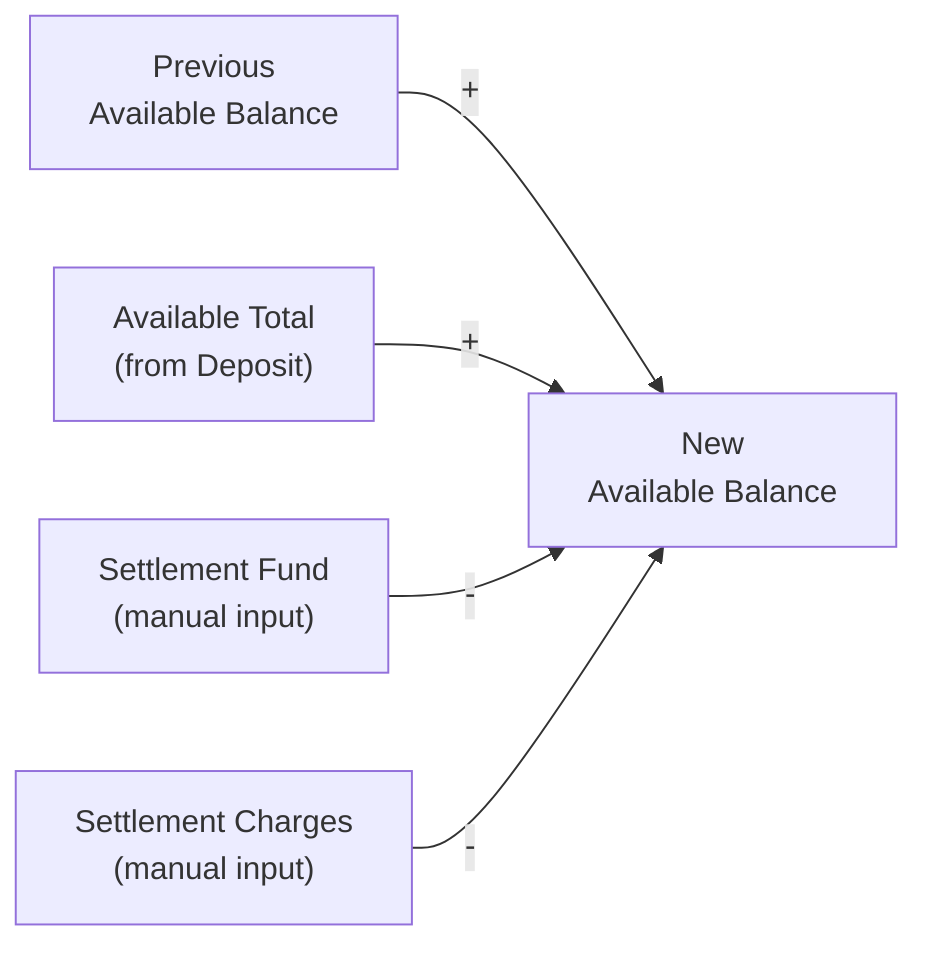
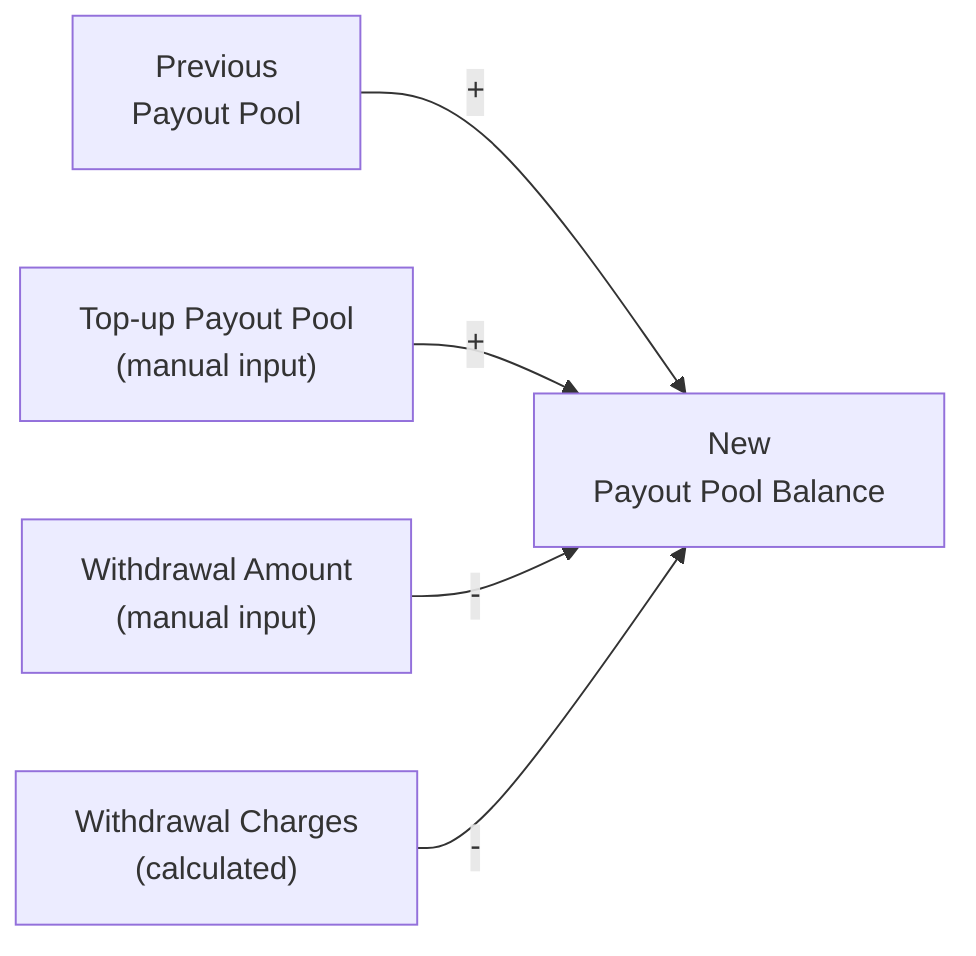
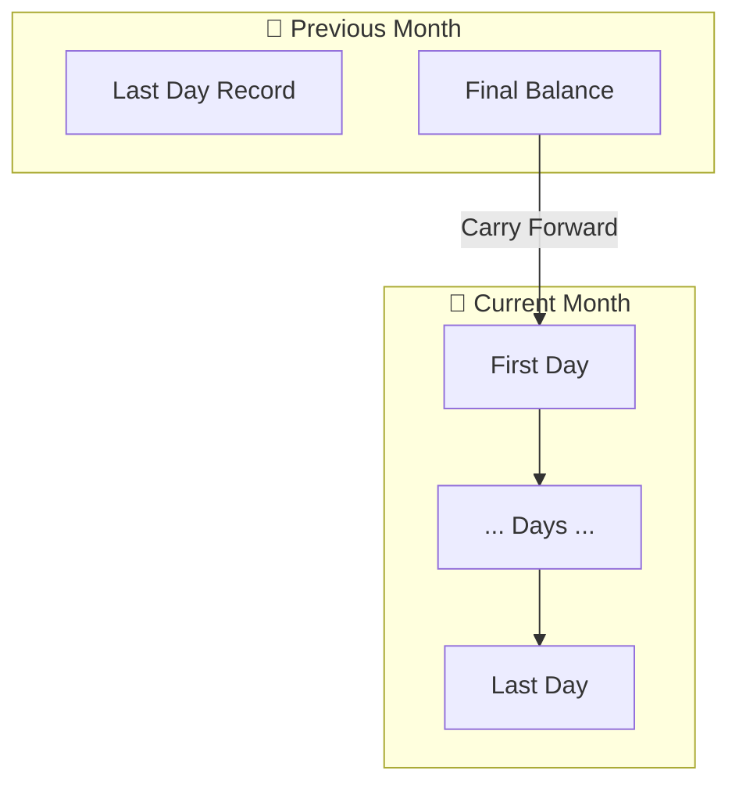
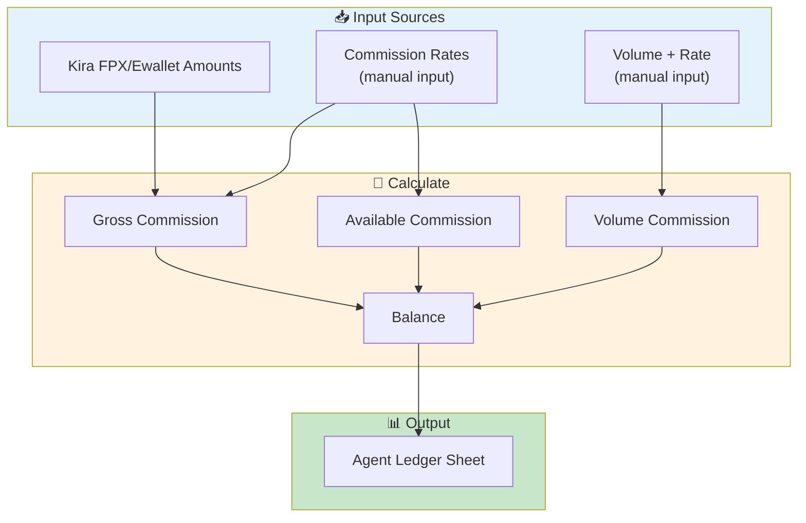
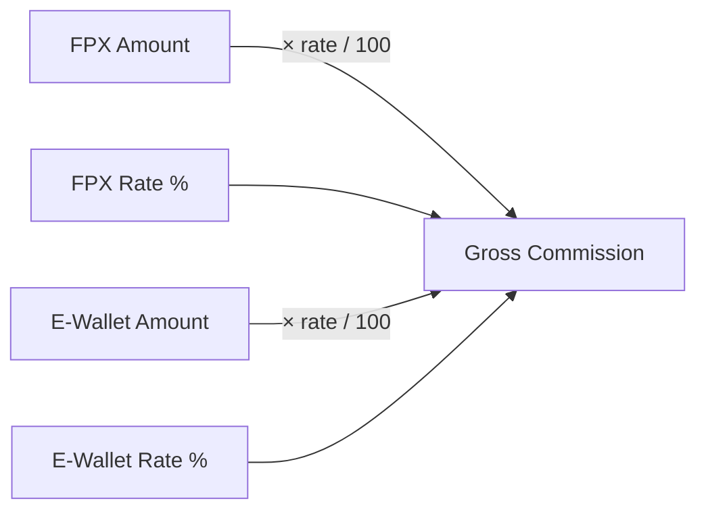
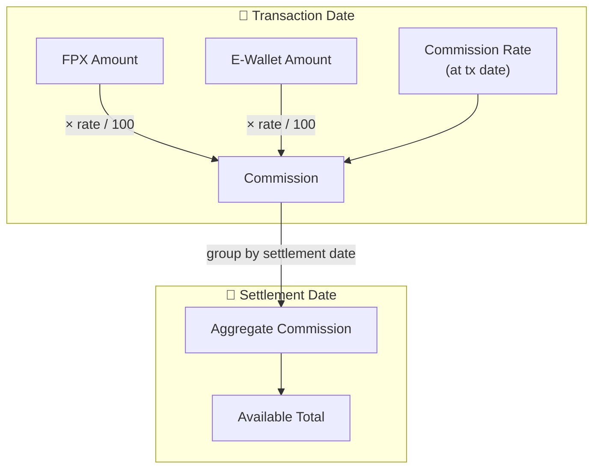
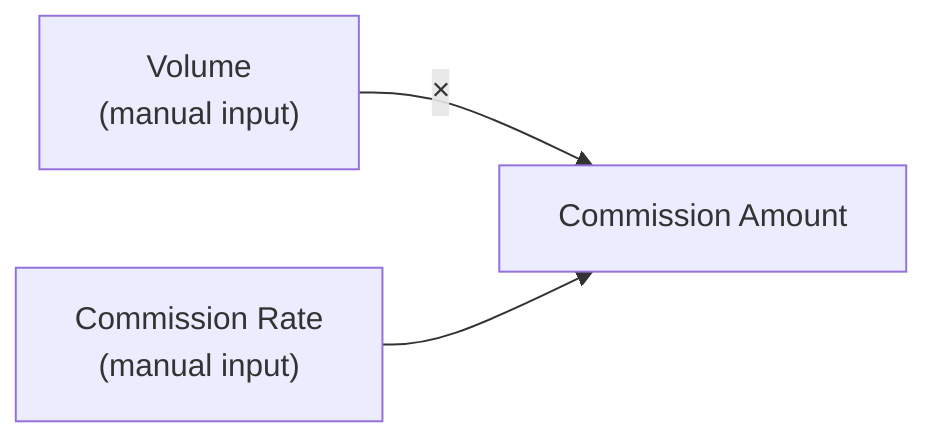
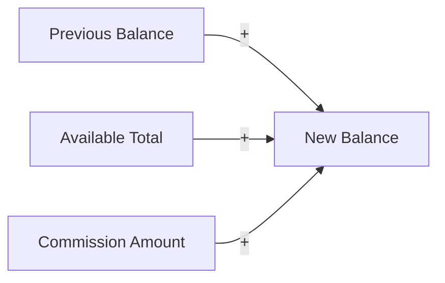

# Ledger Flow

Balance calculation for Merchant and Agent Ledger.

## 🏦 Merchant Ledger Overview



## 💰 Available Balance Calculation



**Formula:**
```
available_balance = prev_available_balance 
                  + available_total 
                  - settlement_fund 
                  - settlement_charges
```

## 💳 Payout Pool Balance Calculation



**Formula:**
```
payout_pool_balance = prev_payout_pool 
                    - withdrawal_amount 
                    - withdrawal_charges 
                    + topup_payout_pool

withdrawal_charges = withdrawal_amount × (withdrawal_rate / 100)
```

## 📊 Carry-Forward Optimization

Balance calculation now uses carry-forward from previous month:



---

## 👤 Agent Ledger Overview



## 🧮 Commission Calculation

### Gross Commission (Daily)



**Formula:**
```
fpx_commission = fpx_amount × (rate_fpx / 100)
ewallet_commission = ewallet_amount × (rate_ewallet / 100)
gross = fpx_commission + ewallet_commission
```

### Available Commission (Settlement-based)

Available Commission is calculated by:
1. Taking commission from each transaction date (using rate at transaction date)
2. Aggregating those commissions by their settlement date



**Formula:**
```
For each deposit on transaction_date:
  fpx_commission = fpx_amount × (rate_fpx_at_tx_date / 100)
  ewallet_commission = ewallet_amount × (rate_ewallet_at_tx_date / 100)

Then aggregate by settlement_date:
  available_fpx = Σ fpx_commission (where fpx_settlement_date = current_date)
  available_ewallet = Σ ewallet_commission (where ewallet_settlement_date = current_date)
  available_total = available_fpx + available_ewallet
```

### Volume Commission



**Formula:**
```
commission_amount = volume × commission_rate
```

## 💰 Balance Calculation



**Formula:**
```
balance = prev_balance + available_total + commission_amount
```

---

## 📋 Sheet Structures

### Merchant Ledger Sheet

| Column | Field | Editable |
|--------|-------|----------|
| A | ID | ❌ |
| B | Date | ❌ |
| C-E | FPX (Amount, Fee, Gross) | ❌ |
| F-H | E-Wallet (Amount, Fee, Gross) | ❌ |
| I-J | Total (Gross, Fee) | ❌ |
| K-M | Available (FPX, E-Wallet, Total) | ❌ |
| N | Settlement Fund | ✅ |
| O | Settlement Charges | ✅ |
| P | Withdrawal Amount | ✅ |
| Q | Withdrawal Rate | ✅ |
| R | Withdrawal Charges | ❌ (calculated) |
| S | Top-up Payout Pool | ✅ |
| T | Payout Pool Balance | ❌ (calculated) |
| U | Available Balance | ❌ (calculated) |
| V | Total Balance | ❌ (calculated) |
| X | Remarks | ✅ |

### Agent Ledger Sheet

| Column | Field | Editable |
|--------|-------|----------|
| A | ID | ❌ |
| B | Date | ❌ |
| C | FPX Rate (%) | ✅ |
| D | FPX Commission | ❌ (calculated) |
| E | E-Wallet Rate (%) | ✅ |
| F | E-Wallet Commission | ❌ (calculated) |
| G | Gross Amount | ❌ (calculated) |
| H | Available FPX | ❌ (calculated from tx date) |
| I | Available E-Wallet | ❌ (calculated from tx date) |
| J | Available Total | ❌ (calculated) |
| K | Volume | ✅ |
| L | Commission Rate | ✅ |
| M | Commission Amount | ❌ (calculated) |
| N | Debit | ✅ |
| O | Balance | ❌ (calculated) |
| P | Accumulative Balance | ❌ (calculated) |
| Q | Updated At | ❌ |
