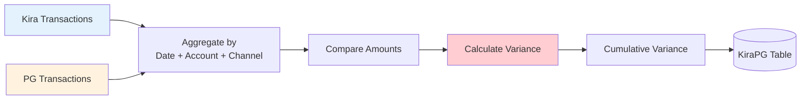
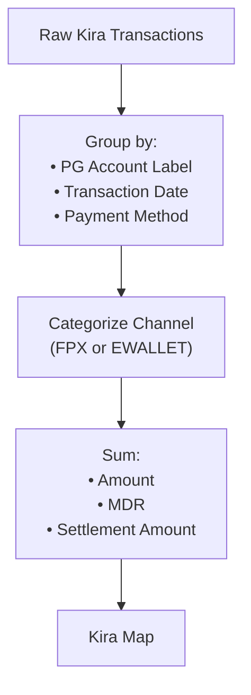
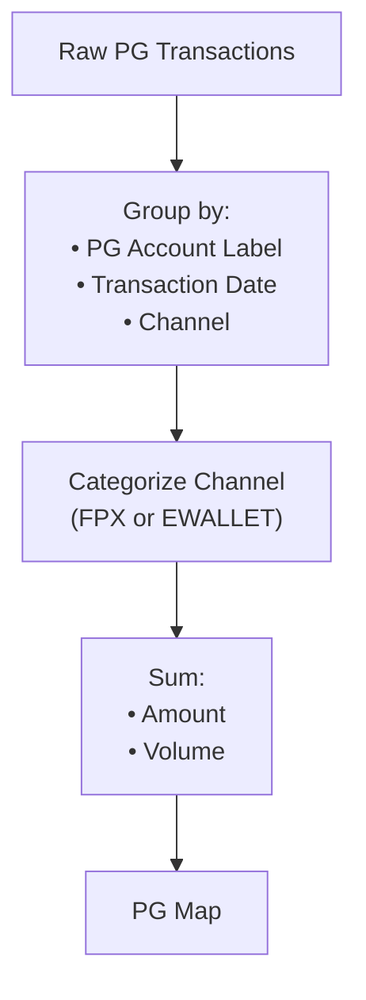
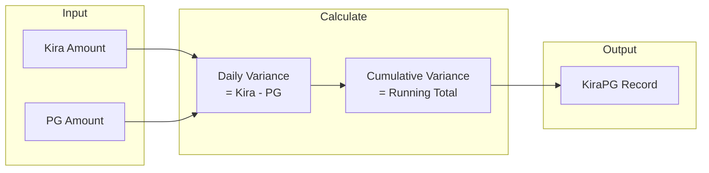
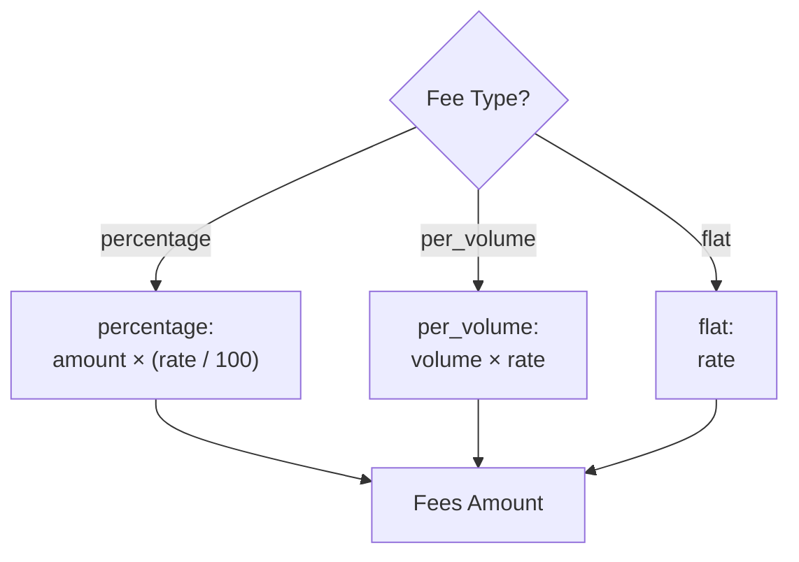
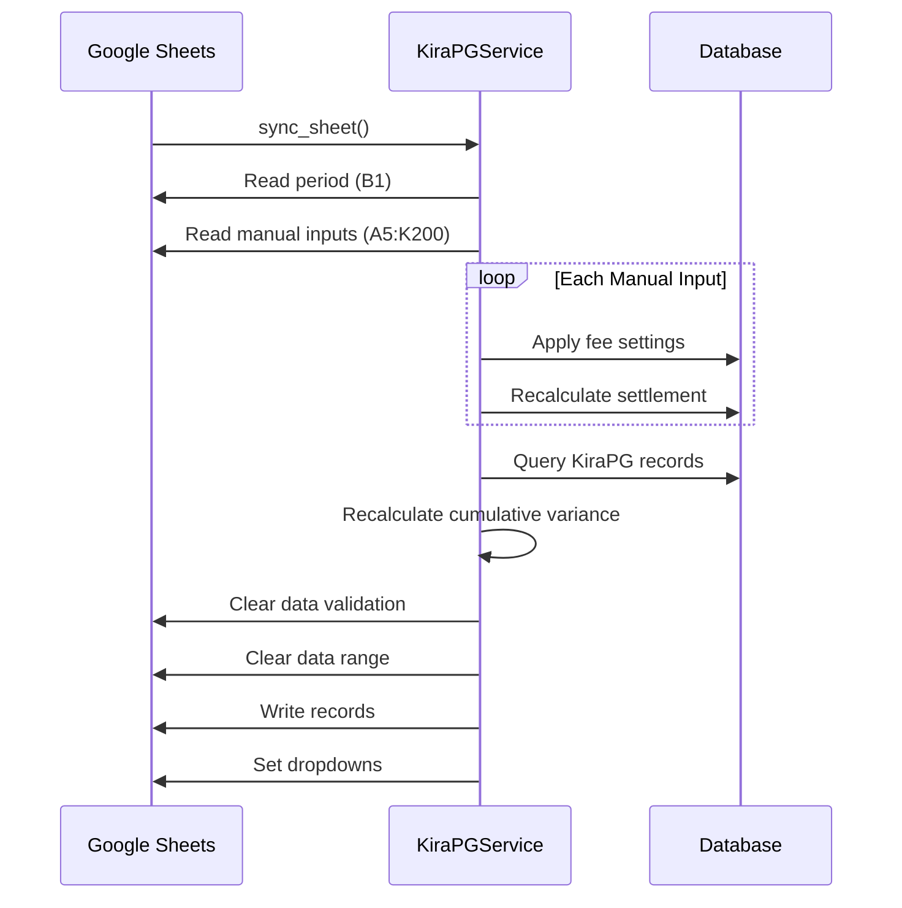

# Reconciliation Flow

Detailed Kira vs Payment Gateway transaction reconciliation flow.

## 🔄 Reconciliation Overview

## 📊 Data Aggregation

### Kira Data Aggregation

### PG Data Aggregation

## 🧮 Variance Calculation

### Formula

| Field | Formula |
|-------|---------|
| Daily Variance | `kira_amount - pg_amount` |
| Cumulative Variance | `sum(daily_variance)` ordered by date |
| Settlement Amount | `pg_amount - fees` |
| Fees | Based on fee_type and fee_rate |

## 📋 Fee Calculation

## 🔃 Sync Flow Detail

## 📋 Sheet Structure - Kira PG

| Column | Field | Editable |
|--------|-------|----------|
| A | ID | ❌ |
| B | Transaction Date | ❌ |
| C | PG Account | ❌ |
| D | Channel | ❌ |
| E | Kira Amount | ❌ |
| F | MDR | ❌ |
| G | PG Amount | ❌ |
| H | Volume | ❌ |
| I | Settlement Rule | ✅ Dropdown |
| J | Settlement Date | ❌ (calculated) |
| K | Fee Type | ✅ Dropdown |
| L | Fee Rate | ✅ |
| M | Fees | ❌ (calculated) |
| N | Settlement Amount | ❌ (calculated) |
| O | Daily Variance | ❌ |
| P | Cumulative Variance | ❌ |

## ⚠️ Variance Alert

Variance indicates discrepancy between Kira and PG:
- **Positive**: Kira > PG (money missing from PG)
- **Negative**: PG > Kira (extra in PG)
- **Zero**: Perfectly matched ✅
