# Scraper Flow

Detailed scraping process flow for each platform.

## 🌐 Scraper Architecture


## 🔐 Session Management


## 📋 AXAI Scraper Flow

```mermaid
flowchart TB
    subgraph Login["🔐 Login"]
        L1["Navigate to login page"]
        L2["Fill username/password"]
        L3["Wait for CAPTCHA (manual)"]
        L4["Submit login"]
        L1 --> L2 --> L3 --> L4
    end

    subgraph Navigate["📍 Navigate"]
        N1["Open sidebar menu"]
        N2["Click Payment Details"]
        N3["Wait for page load"]
        N1 --> N2 --> N3
    end

    subgraph Filter["🔍 Set Filters"]
        F1["Select Success status"]
        F2["Select Fail status"]
        F3["Open From date picker"]
        F4["Select from date"]
        F5["Open To date picker"]
        F6["Select to date"]
        F1 --> F2 --> F3 --> F4 --> F5 --> F6
    end

    subgraph Export["📥 Export"]
        E1["Click Export button"]
        E2["Wait for download"]
        E3["Rename file"]
        E1 --> E2 --> E3
    end

    Login --> Navigate --> Filter --> Export
```



### AXAI Status Update Flow


## 📋 Kira Scraper Flow

```mermaid
flowchart TB
    subgraph Login["🔐 Login"]
        L1["Navigate to login"]
        L2["Fill credentials"]
        L3["Submit"]
        L1 --> L2 --> L3
    end

    subgraph Export["📥 Export"]
        E1["Navigate to reports"]
        E2["Set date range"]
        E3["Generate report"]
        E4["Download CSV"]
        E1 --> E2 --> E3 --> E4
    end

    Login --> Export
```



## 📋 M1 Scraper Flow

```mermaid
flowchart TB
    subgraph Login["🔐 Login"]
        L1["Navigate to bank portal"]
        L2["Fill credentials"]
        L3["2FA if required"]
        L1 --> L2 --> L3
    end

    subgraph Export["📥 Export"]
        E1["Navigate to statements"]
        E2["Select account"]
        E3["Set date range"]
        E4["Download statement"]
        E1 --> E2 --> E3 --> E4
    end

    Login --> Export
```



## 🗂️ File Naming Convention

Downloaded files are renamed to include date range:

```
{account_label}_{from_date}_{to_date}.csv

Examples:
- merchant_a_2026-01-01_2026-01-31.csv
- kira_2026-01-01_2026-01-31.xlsx
```

## ⚠️ Error Handling

| Error Type | Handling |
|------------|----------|
| Session expired | Open visible browser for re-login |
| CAPTCHA required | Update job status, wait for manual input |
| Download timeout | Retry with increased timeout |
| Network error | Log error, mark job as failed |

## 🔧 Configuration

```json
{
  "accounts": [
    {
      "label": "merchant_a",
      "platform": "axai",
      "credentials": {
        "email": "user@example.com",
        "password": "secret"
      }
    }
  ]
}
```
