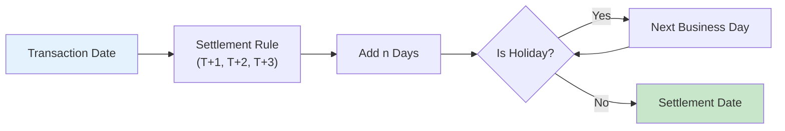
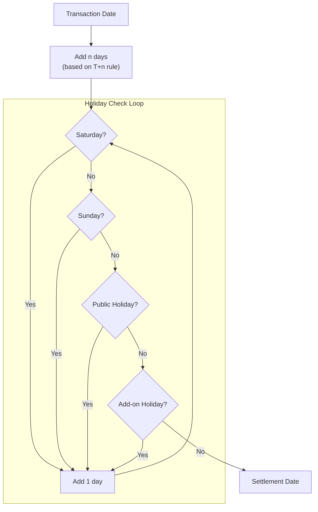
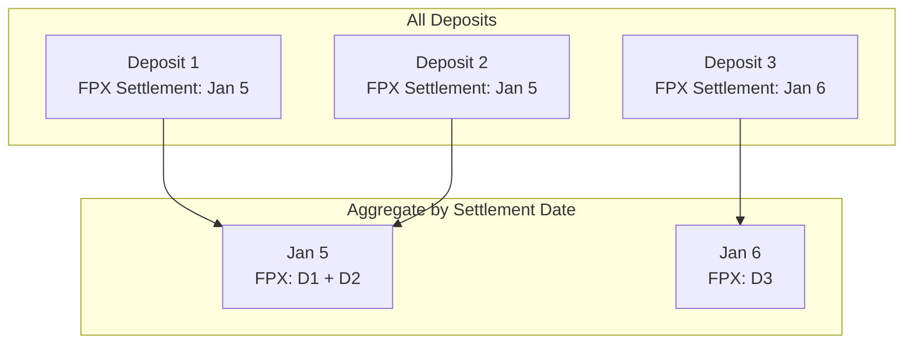

# Settlement Flow

Settlement date calculation based on T+n rules and holidays.

## 📅 Settlement Date Overview



## 🧮 Calculation Logic



## 📋 Settlement Rules

| Rule | Description | Example |
|------|-------------|---------|
| T+0 | Same day | Mon → Mon |
| T+1 | Next business day | Mon → Tue |
| T+2 | 2 business days | Mon → Wed |
| T+3 | 3 business days | Mon → Thu |

## 🗓️ Holiday Sources

### 1. Malaysia Public Holidays

Loaded from `utils/holiday.py` - Malaysia official holidays:

```python
# Examples
"2026-01-01"  # New Year
"2026-02-01"  # Thaipusam
"2026-05-01"  # Labour Day
"2026-08-31"  # Merdeka Day
...
```

### 2. Add-on Holidays

Custom holidays from Parameter sheet:

| Date | Description |
|------|-------------|
| 2026-01-02 | Company Anniversary |
| 2026-05-02 | Extra Leave |

## 📊 Example Calculations

### Example 1: Normal Case
```
Transaction: 2026-01-05 (Monday)
Rule: T+1
Settlement: 2026-01-06 (Tuesday) ✅
```

### Example 2: Weekend Skip
```
Transaction: 2026-01-09 (Friday)
Rule: T+1
→ 2026-01-10 (Saturday) → Skip
→ 2026-01-11 (Sunday) → Skip
Settlement: 2026-01-12 (Monday) ✅
```

### Example 3: Holiday Skip
```
Transaction: 2026-04-30 (Thursday)
Rule: T+1
→ 2026-05-01 (Friday - Labour Day) → Skip
→ 2026-05-02 (Saturday) → Skip
→ 2026-05-03 (Sunday) → Skip
Settlement: 2026-05-04 (Monday) ✅
```

## 🔄 Available Settlement Calculation

Available settlement aggregates deposits that settle on each date:



## 📋 Sheet Structure - Deposit

| Column | Field | Editable |
|--------|-------|----------|
| A | ID | ❌ |
| B | Date | ❌ |
| C | FPX Amount | ❌ |
| D | FPX Volume | ❌ |
| E | FPX Fee Type | ✅ Dropdown |
| F | FPX Fee Rate | ✅ |
| G | FPX Fee Amount | ❌ (calculated) |
| H | FPX Gross | ❌ (calculated) |
| I | FPX Settlement Rule | ✅ Dropdown |
| J | FPX Settlement Date | ❌ (calculated) |
| K-R | E-Wallet (same structure) | |
| S | Total Amount | ❌ |
| T | Total Fees | ❌ |
| U | Available FPX | ❌ |
| V | Available E-Wallet | ❌ |
| W | Available Total | ❌ |
| X | Remarks | ✅ |

## ⚙️ Configuration

Add-on holidays can be configured via Parameter sheet:

```
| Type            | Key        | Value | Description     |
|-----------------|------------|-------|-----------------|
| ADD_ON_HOLIDAYS | 2026-01-02 |       | Company Day     |
| ADD_ON_HOLIDAYS | 2026-05-02 |       | Extra Leave     |
```
